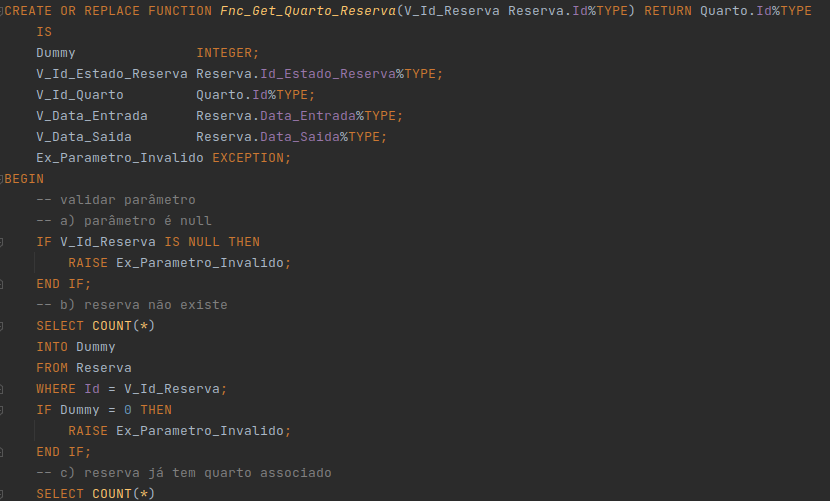
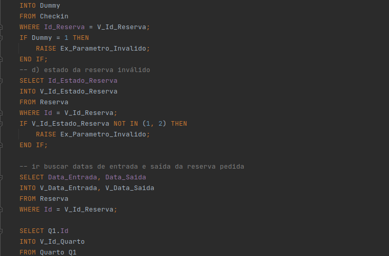
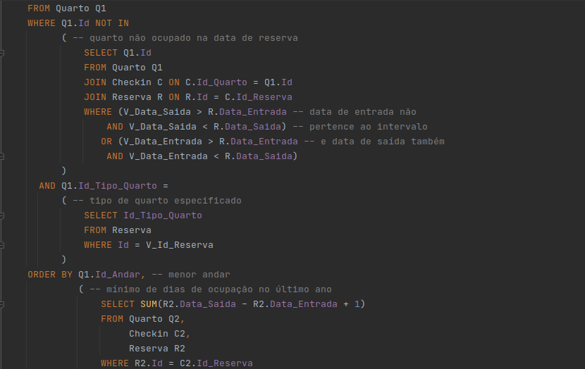
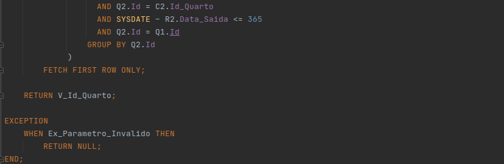
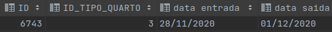
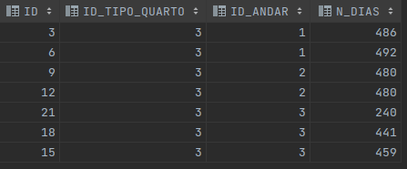
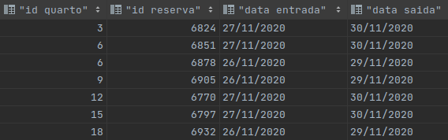
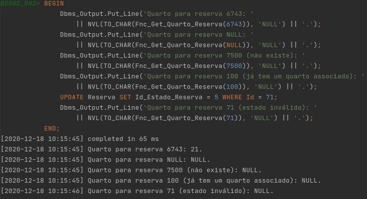

### Exercício 1 ###

Pretende provar-se que, quando invocamos a função dando como parâmetro uma reserva sem checkin efetuado, esta vai
retornar o quarto do andar mais baixo, com o mínimo de dias de ocupação no último ano, e que não esteja ocupado no
período de estada da reserva enviada por parâmetro.

Esta reserva ainda não tem o checkin efetuado:

Todos os quartos do tipo 3, ordenados pelo andar e pelo número de dias de ocupação no último ano:

Todos os quartos do tipo 3 ocupados durante o período de estada da reserva 6743:

Assim, espera-se que a função retorne o valor 21, já que os quartos 3, 6, 9 e 12 (que teriam prioridade de escolha por
serem de um andar inferior ou terem tido menos dias de ocupação no último ano) estão ocupados durante o período de
estada da reserva 6853. Aqui está um bloco anónimo que demonstra isso mesmo, e também testa as condições em que a função
deve retornar NULL:

