### Exercício 2 ###

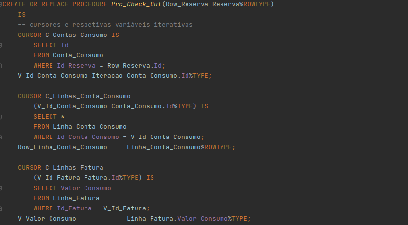
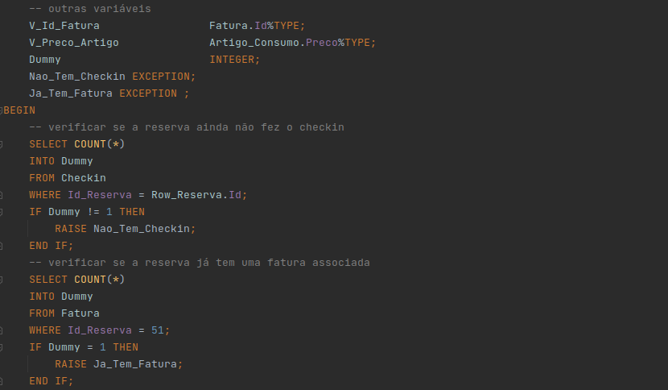
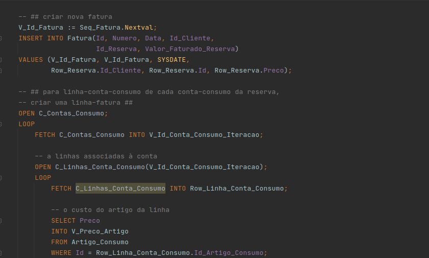
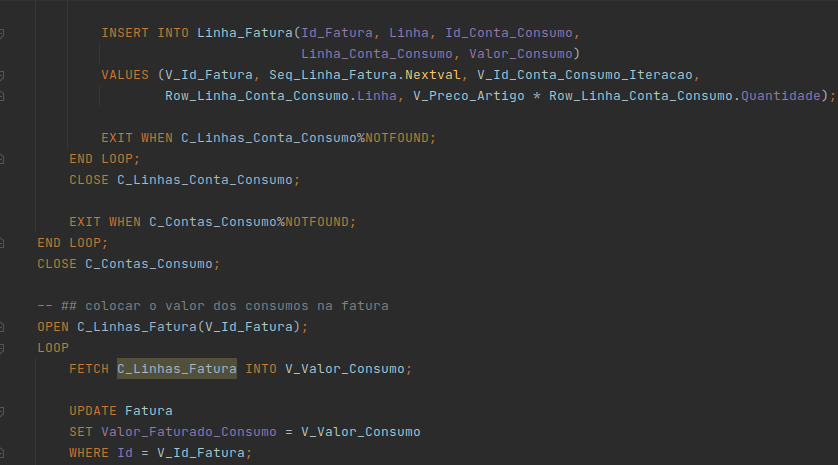
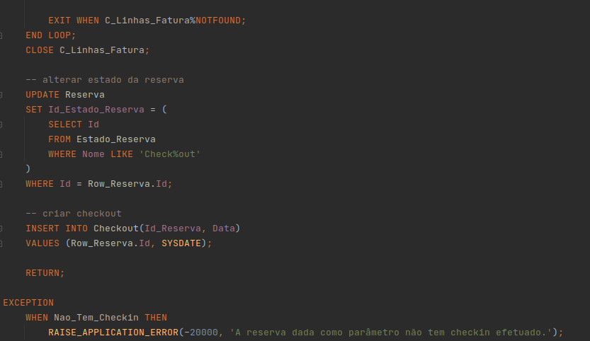
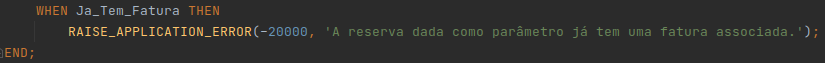

Para executarmos o procedimento, precisamos de uma reserva que tenham efetuado check-in mas não o check-out. Nos dados
existentes não existe nenhuma reserva nesta situação, por isso vamos fazer com que duas fiquem:

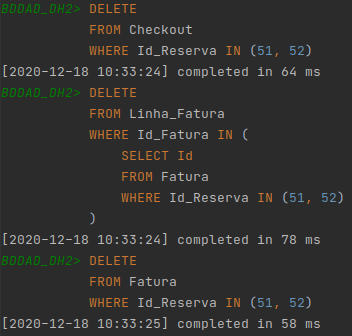

Resultado da query que busca todas as reservas com checkin efetuado, mas não checkout:

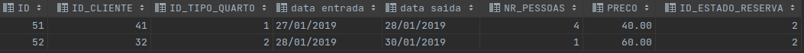
Todos os checkouts, respetiva fatura, e respetivas linhas de fatura foram apagados.

Esta query permite-nos visualizar todos os consumos (e respetivas quantidades) de todas as linhas de conta de consumo de
todas as contas de consumo da reserva 51:

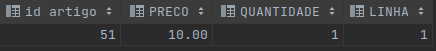

Execução do procedimento através de um bloco anónimo:

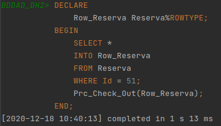

Visualização de todas as faturas existentes:

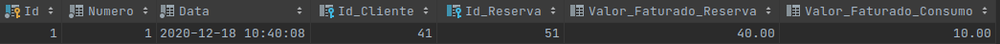

O valor faturado em consumos está de acordo com o previsto. O valor faturado na reserva foi copiado da reserva para a
fatura, e também está de acordo com o que seria previsível.

Além disso, o estado da reserva também deverá ter sido atualizado:

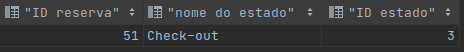

E deverá ter sido adicionada uma linha à tabela checkout:

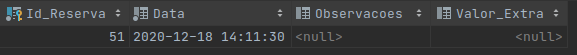

Tentemos correr o mesmo bloco anónimo outra vez, dando ao procedimento a reserva 51 novamente. Deverá provocar exceção,
já que não deve ser possível criar duas faturas para uma reserva.

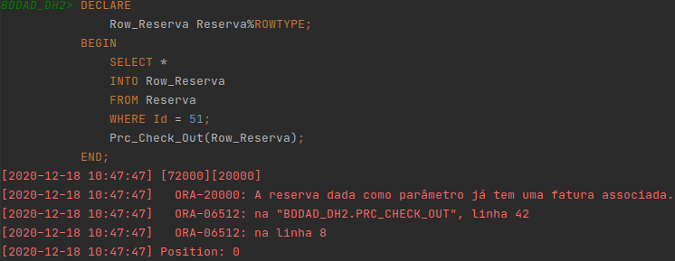
É o resultado que se esperava.

Testemos também o comportamento do procedimento se for passada por parâmetro uma reserva que não tenha efetuado o
checkin:

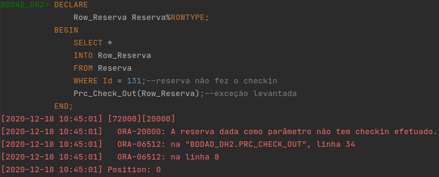

O procedimento levantou a exceção, e a nova fatura não foi criada:

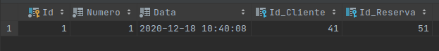

A única fatura que existe continua a ser a da reserva 51.
