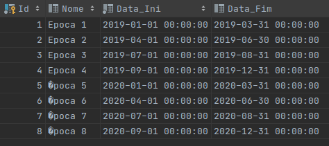

### Exercício 3 ###

Execução do trigger:

Estas são as épocas existentes na base de dados:

Se tentarmos inserir uma nova época numa data que intercete noutra época, vai ser levanta-da uma exceção. Vemos isso
acontecer nesta imagem:

A data que se tentou inserir colide com a da época de ID 4, e isso é explicado na mensagem da exceção.

E verifica-se que a época não foi adicionada:

No entanto, se inserirmos uma época com data válida...

... o trigger não interfere:

