# Exercício 7 #

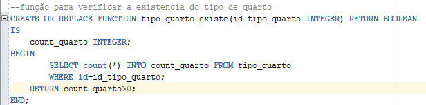
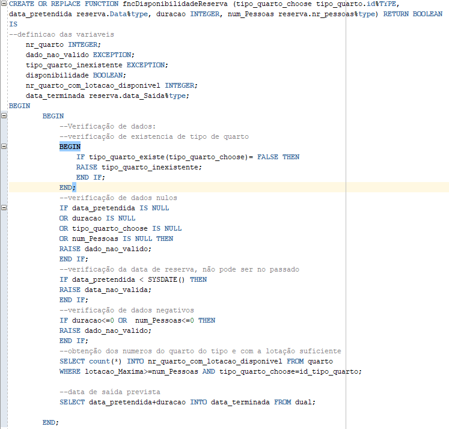
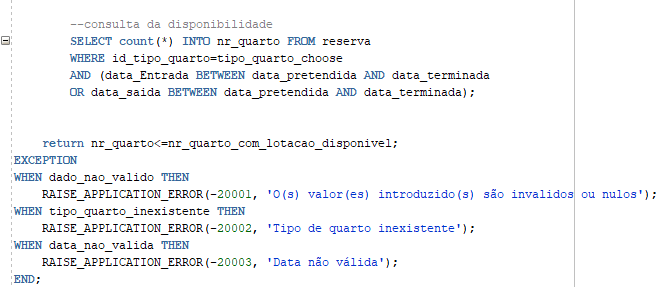

Pretende provar-se que, quando invocamos a função dando os parametros exigidos, nomeadamente, id do tipo quarto, data de entrada, duracao e numero de pessoas ele retorna True se estiver disponivel, ou false se não estiver disponivel quarto pra reserva.

A data introduzida é menor do que o dia que fora tentado marcado:

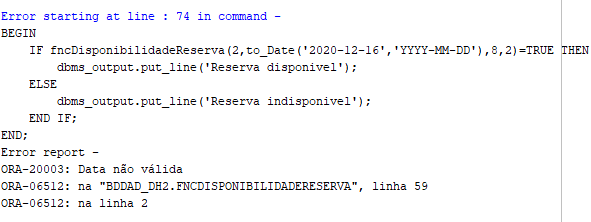

Uma data disponivel na base de dados:

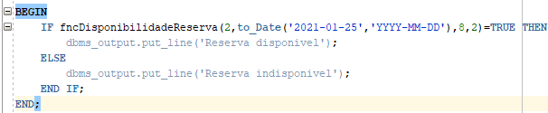
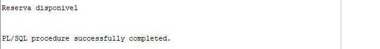

Umas reservas em que não há mais quartos disponiveis:

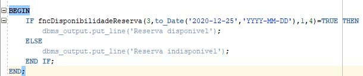
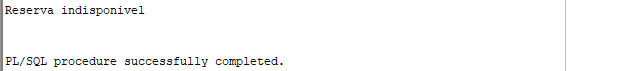

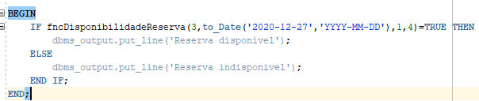
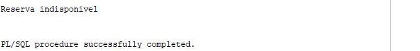

E o último caso em que o tipo de quarto não existe:

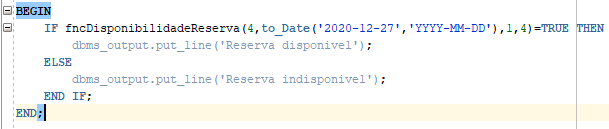
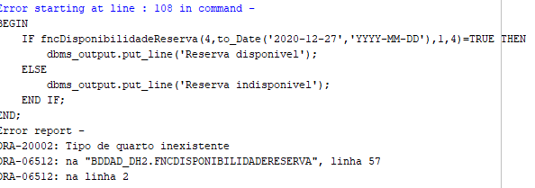
