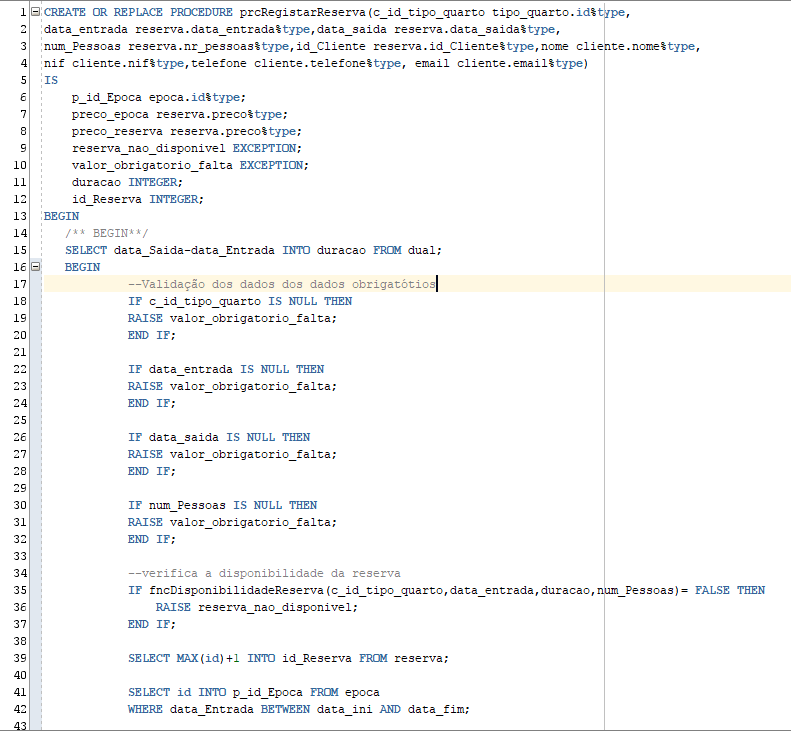
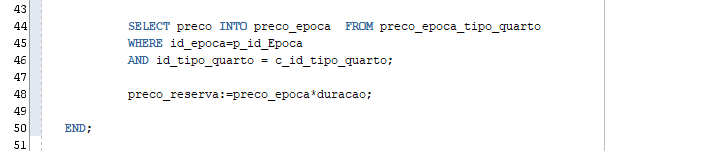
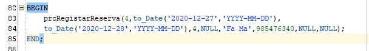
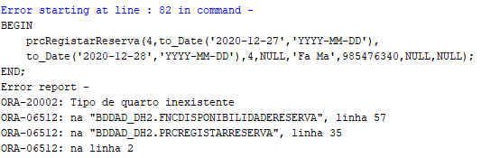
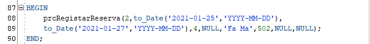
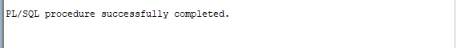
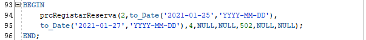
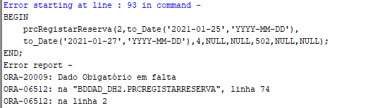
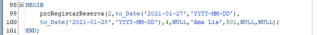
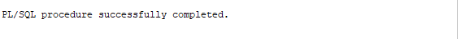

### Exercício 8 ###

Para executarmos o procedimento, precisamos de dados, sendo uns obrigatórios ou não, e caso um dado obrigatório estiver em falta o procedimento para e lança uma excessão notificando o utilizador da falta de um dos dados.

Primeiro teste que fizemos foi com tipo de quarto inexistente:

De seguida fizemos tentativa com dados que havia tido sucesso na funcção de disponibilidade de reserva:

E a seguida, fizemos tentativa com quarto já ocupado:

E por fim nova tentativa com reserva disponivel:

