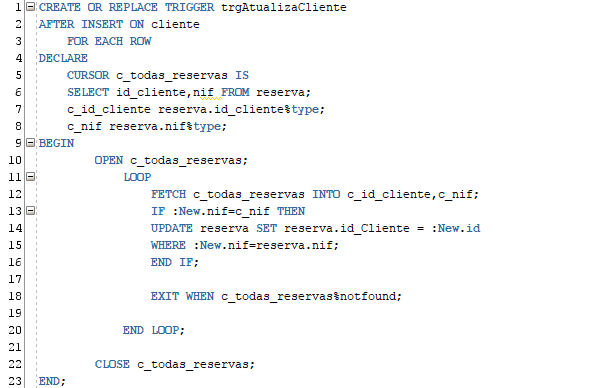
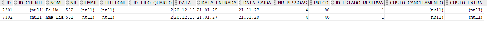
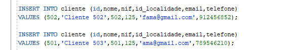
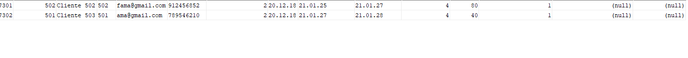

# Exercício 9 #

Pretende provar-se que, quando inserido um novo cliente na tabela cliente o trigger atualiza o id cliente na tabela reserva.
Por isso inicialmente, com os dados que foram inseridos anteriormente na tabela reserva, fazemos uma consulta e verificamos as informações sobre o cliente em que temos o seguint resultado:

Então inserimos os dados do cliente na tabela cliente em que então temos todos os dados do cliente, através do insert:

E então temos atualização, depois de inserida os dados de cliente, na tabela reserva:

 